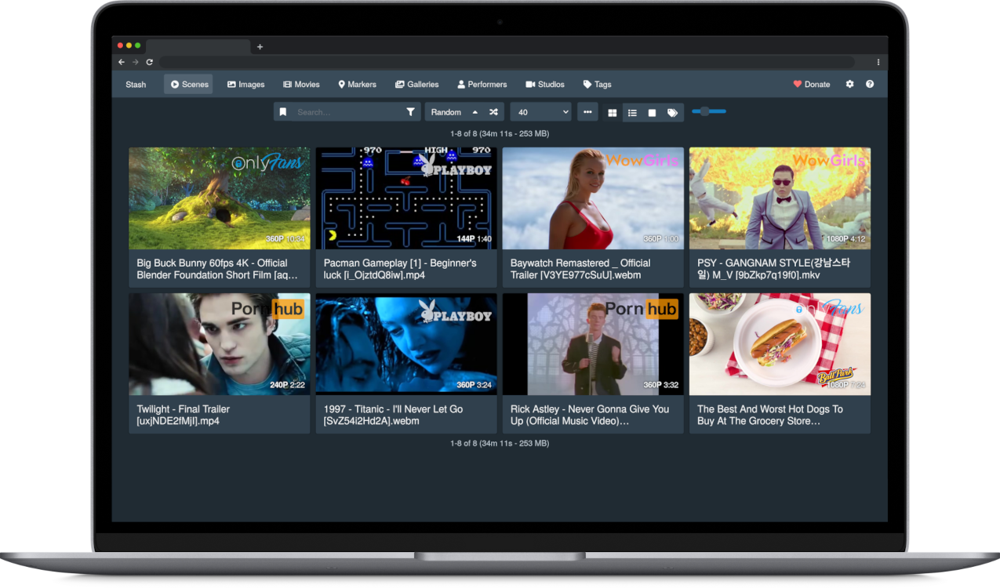

<!--
N.B.: This README was automatically generated by https://github.com/YunoHost/apps/tree/master/tools/README-generator
It shall NOT be edited by hand.
-->

# Stash for YunoHost

[](https://dash.yunohost.org/appci/app/stash)  

[](https://install-app.yunohost.org/?app=stash)

*[Lire ce readme en français.](./README_fr.md)*

> *This package allows you to install Stash quickly and simply on a YunoHost server.
If you don't have YunoHost, please consult [the guide](https://yunohost.org/#/install) to learn how to install it.*

## Overview

Stash is a self-hosted webapp written in Go which organizes and serves your videos.

### Features

- Stash gathers information about videos in your collection from the internet, and is extensible through the use of community-built plugins for a large number of content producers and sites.
- Stash supports a wide variety of both video and image formats.
- You can tag videos and find them later.
- Stash provides statistics about performers, tags, studios and more.


**Shipped version:** 0.18.0~ynh1


## Screenshots



## Documentation and resources

* Official app website: <https://stashapp.cc/>
* Official admin documentation: <https://docs.stashapp.cc/>
* Upstream app code repository: <https://github.com/stashapp/stash>
* YunoHost documentation for this app: <https://yunohost.org/app_stash>
* Report a bug: <https://github.com/YunoHost-Apps/stash_ynh/issues>

## Developer info

Please send your pull request to the [testing branch](https://github.com/YunoHost-Apps/stash_ynh/tree/testing).

To try the testing branch, please proceed like that.

``` bash
sudo yunohost app install https://github.com/YunoHost-Apps/stash_ynh/tree/testing --debug
or
sudo yunohost app upgrade stash -u https://github.com/YunoHost-Apps/stash_ynh/tree/testing --debug
```

**More info regarding app packaging:** <https://yunohost.org/packaging_apps>
